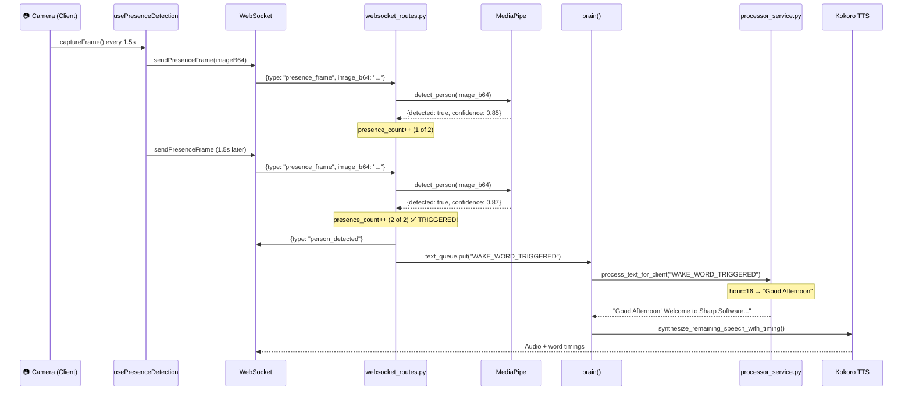

# Presence Detection + Time-Aware Greeting — Walkthrough

## Summary

All tasks from the implementation plan are **complete and verified**. The system supports two activation methods, both producing time-aware greetings:

| Activation Method | Trigger | Greeting |
|---|---|---|
| **Camera Presence** (primary) | Person stands in front of camera for ~3 seconds | ✅ Time-based |
| **Wake Word** (fallback) | User says "Hey Jarvis" | ✅ Time-based |

---

## End-to-End Flow: Presence Detection → Greeting



---

## Time-Based Greeting Logic

The greeting is generated in [processor_service.py](file:///c:/AIRA-Virtual-receptionist/apps/server/services/processor_service.py#L20-L37):

```python
if text == "WAKE_WORD_TRIGGERED":
    clear_session_state(client_id)
    
    hour = datetime.now().hour
    if 5 <= hour < 12:
        greeting = "Good Morning"
    elif 12 <= hour < 17:
        greeting = "Good Afternoon"
    else:
        greeting = "Good Evening"

    state = get_session_state(client_id)
    state["greeted"] = True

    return f"{greeting}! Welcome to Sharp Software Development India Private Limited. I am Jarvis, how can I assist you today?"
```

| Time Range | Greeting |
|---|---|
| 5:00 AM – 11:59 AM | Good Morning |
| 12:00 PM – 4:59 PM | Good Afternoon |
| 5:00 PM – 4:59 AM | Good Evening |

The same `_get_time_greeting()` helper also exists in [query_router.py](file:///c:/AIRA-Virtual-receptionist/apps/server/services/query_router.py#L185-L192) as a backup path.

---

## Files Implemented

### Server
| File | Status | Purpose |
|---|---|---|
| [person_detection_service.py](file:///c:/AIRA-Virtual-receptionist/apps/server/services/person_detection_service.py) | ✅ Created | MediaPipe Face Detection singleton |
| [websocket_routes.py](file:///c:/AIRA-Virtual-receptionist/apps/server/routes/websocket_routes.py) | ✅ Modified | `presence_frame` handler, session state, executor |
| [processor_service.py](file:///c:/AIRA-Virtual-receptionist/apps/server/services/processor_service.py) | ✅ Has greeting | Time-aware greeting on WAKE_WORD_TRIGGERED |
| [query_router.py](file:///c:/AIRA-Virtual-receptionist/apps/server/services/query_router.py) | ✅ Has greeting | `_get_time_greeting()` helper |
| [pyproject.toml](file:///c:/AIRA-Virtual-receptionist/apps/server/pyproject.toml) | ✅ Updated | `mediapipe==0.10.14` dependency |
| [.env](file:///c:/AIRA-Virtual-receptionist/apps/server/.env) | ✅ Updated | Presence detection tuning vars |

### Client
| File | Status | Purpose |
|---|---|---|
| [WebSocketContext.tsx](file:///c:/AIRA-Virtual-receptionist/apps/client/src/contexts/WebSocketContext.tsx) | ✅ Modified | `sendPresenceFrame()` + `onPersonDetected()` |
| [usePresenceDetection.ts](file:///c:/AIRA-Virtual-receptionist/apps/client/src/hooks/usePresenceDetection.ts) | ✅ Created | Frame polling loop (1.5s interval) |
| [page.tsx](file:///c:/AIRA-Virtual-receptionist/apps/client/src/app/page.tsx) | ✅ Modified | Auto-camera, presence hook, green glow |
| [CameraStream.tsx](file:///c:/AIRA-Virtual-receptionist/apps/client/src/components/CameraStream.tsx) | ✅ Modified | Camera auto-starts on page load |

---

## How to Test

1. **Start the server**: `cd apps/server && uv run uvicorn main:app --reload`
2. **Start the client**: `cd apps/client && pnpm dev`
3. **Open the browser** → Camera should auto-start
4. **Stand in front of the camera** → Within ~3 seconds, AIRA should say the time-appropriate greeting
5. **Alternatively, say "Hey Jarvis"** → Same greeting fires via wake word
6. **Walk away and return** → After 5-second cooldown, re-activation works
